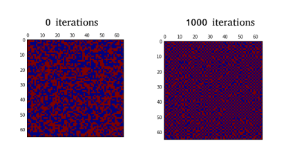
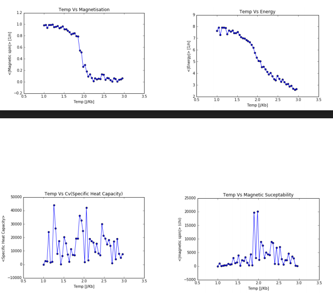

# Ising Model

Measuring the temperature of phase change of a ferromagnetic (has a magnetic moment due to aligned spins) material to an antiferromagnetic (has no magnetic moment due to opposite-aligned spins) material. 

A matrix representing a material, starting with random spins distributed and having a temperature above the critical temperature required for a phase transition. after 1000 iterations the model is clearly in an antiferromagnetic state, with opposing spin beside one another.

Below the critical temperature for a phase transition the interaction between molecules is altered through its temperature dependency. Trough this the material now interacts to form a Ferromagnetic material.

Data produced from the simulation clearly shows a phase transition occuring at ~2°K, With a significant drop in both system energy and magnetisation at this temperature. 

