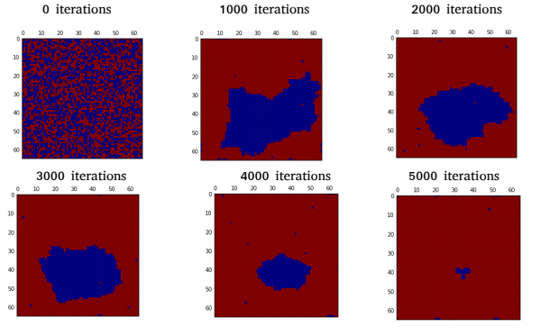

Ising Model.
Measuring the temperature of phase change of a ferromagnetic(has a magnetic moment due to aligned spins) material to an antiferromagnetic(has no magnetic moment due to opposite-aligned spins) material. 

A matrix representing a material, starting its interactions with random spins distributed.

